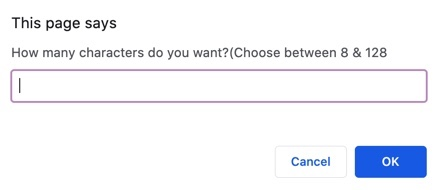
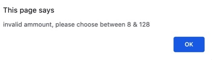
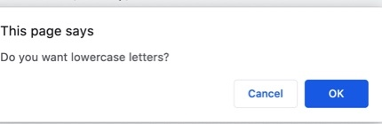
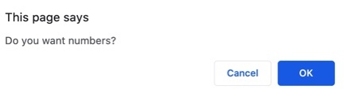
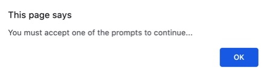
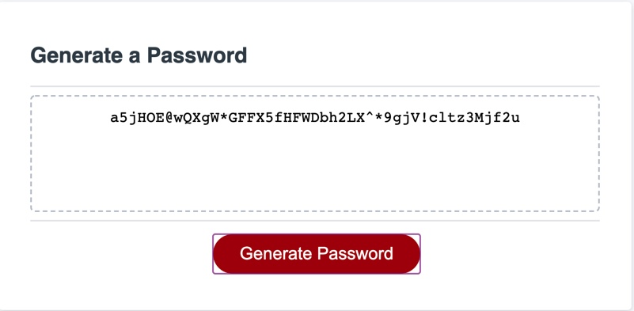
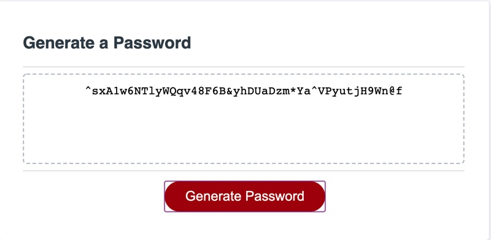

# PasswordGenorator
This is a simple user-inuitive apllication that will generate a password based on certain criteria. 

First, the application will prompt you and ask how many characters your password will have.

If you enter in an invalid amount (anything below 8 or higher than 128) you will be alerted to try again.

Once you put in a acceptable amount, you will be promted to inlude uppercase, lowercase, numbers, and special characters.

If you don't accept any of the previous prompts, you will be alerterd, "you must accept one of the prompts to continue" and sent back to the first criteria prompt.

Once the computer has gathered all information it will generate a password based on all the criteria you selcted. 

If you want to generate a new password, all you have to do is hit 'generate' again.

